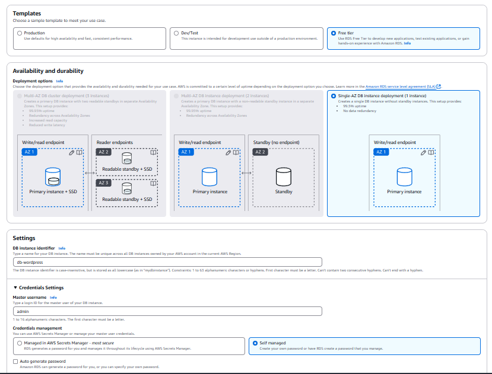
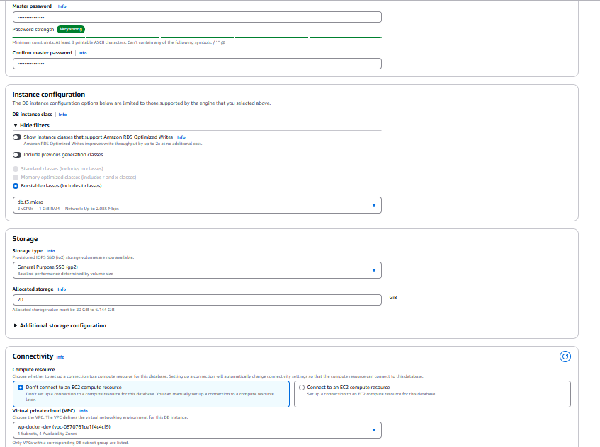
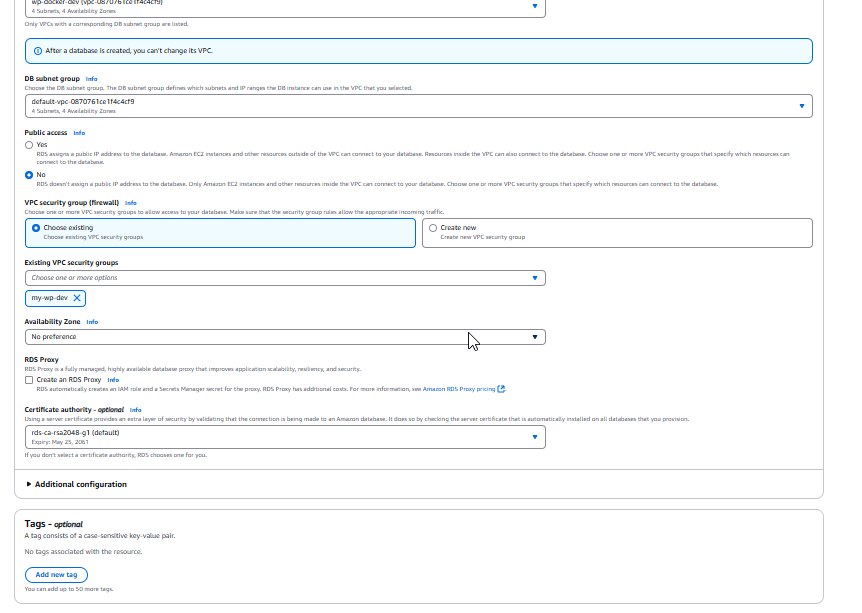
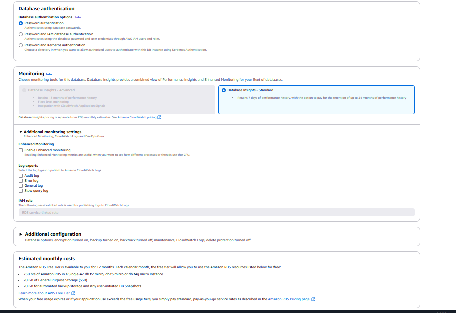
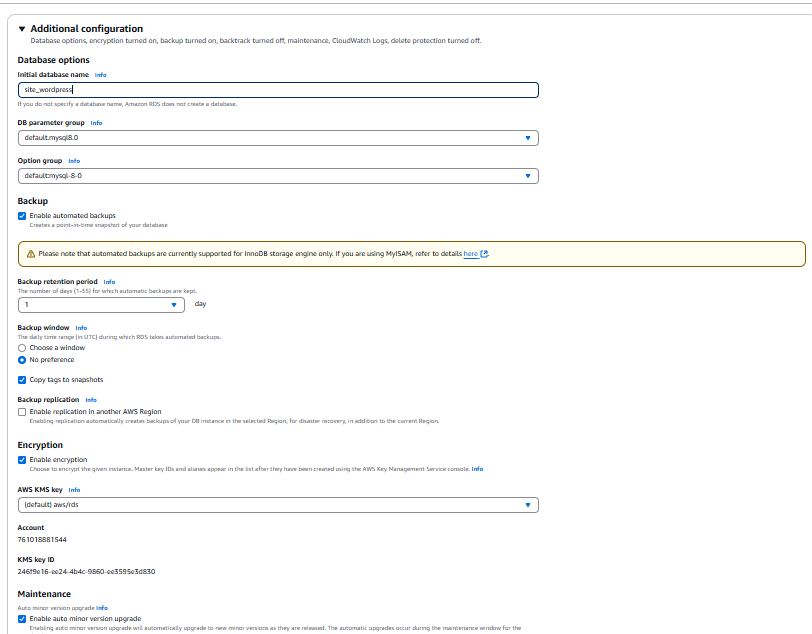
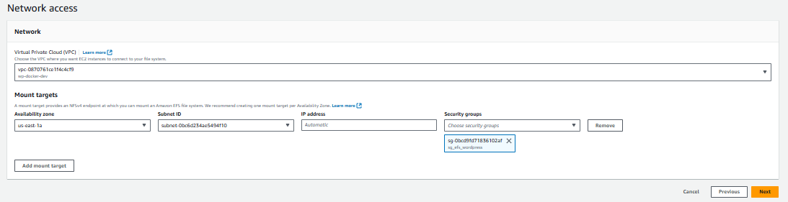
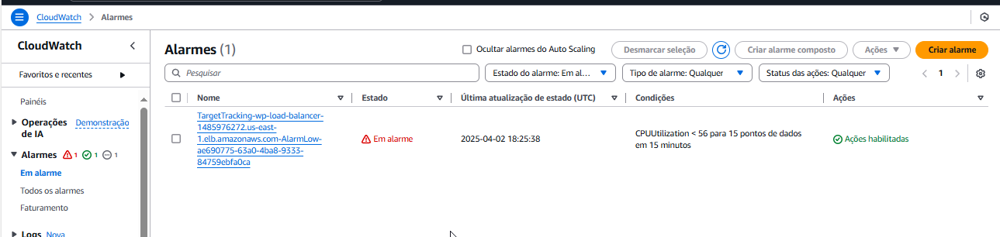

# 🙋‍♂️ Olá, meu nome é Elicarlos, Bem-vindo ao Meu Perfil no GitHub! 

## Sobre Mim
Sou estudante de Segurança da Informação, e atualmente estou desenvolvendo habilidades em Linux, AWS e automação de processos na Compass.Uol.

## Projetos
- DevSecOps - Docker e Wordpress na AWS.

## Contato
- <a href="https://www.linkedin.com/in/elicarlos-amorim"> LinkedIn</a>
- <a href="https://github.com/elicarlos-stack"> GitHub</a>

<hr>

<div align="center">
 

 

 


</div>

# <h1 align="center">Configuração de Servidor Web com Monitoramento</h1>

<p align="center"></p>


## :pushpin: Descrição do projeto:
<div style="text-align: justify">
DevSecOps - Docker</div>

## :hammer: Ferramentas e Tecnologias Utilizadas:
- **Linux (Server Ubuntu)**
- **AWS Cloud**
- **Vscode**
- **Docker**
- **Wordpress**

# Índice

1. [Etapa 1: Configuração do Ambiente](#etapa-1-configuração-do-ambiente)
2. [Etapa 2: Criar o RDS](#etapa-2-criar-o-RDS)
3. [Etapa 3: Criar o EFS](#etapa-3-criar-EFS)
4. [Criar uma instancia EC2](##Criar-uma-instancia-EC2)
5. [Usando User-Data e criando uma launch template](#Usando-User-Data-e-criando-uma-launch-template)
6. [Criando Load Balancer](##Criando-Load-Balancer)
7. [Criando Auto Scaling Group](##Criando-Auto-Scaling-Group2)
8. [Monitoramento no CloudWatch](##Monitoramento-no-CloudWatch)


> [!NOTE]
> Os IPs nestas imagens podem sofre alteração porque foram feitos em momentos separados, caso tenho divergências siga o que voce criou alterando aonde forem solicitados.

# Etapa 1: Configuração do Ambiente :hammer_and_wrench:
Antes de criarmos a nossa Instância EC2 primeiramente vamos criar uma VPC na AWS com 2 subnets públicas e 2 subnets privadas. A VPC é um serviço da AWS que permite criar uma rede virtual isolada dentro da infraestrutura da AWS, para isto com o console aberto da Amazon AWS localize na barra de pesquisar por VPC para criar a VPC logo após criaremos as subnets, depois clique em create VPC ou selecione Your VPCs (suas VPCs) e criar VPC.


Em VPC setting você pode escolher por criar através do VPC only ou VPC and more (Este modo permite criar a VPC junto com recursos adicionais necessários, como sub-redes, tabelas de rotas, gateways da Internet e gateways NAT). Neste exemplo escolheremos VPC only para criar de forma manual, após escolher informe um nome para vpc ex: "wp-docker-dev" e o bloco IPV4 CIDR para a VPC neste exemplo usei 172.18.0.0/20. as outras opções pode deixar como default e finalize clicando em criar VPC (Create VPC).


<div>Agora criaremos 2 subnets privadas e 2 subnets públicas conforme a imagem abaixo. Para isso, na console da AWS, vá para VPC e clique em Subnets -> Create Subnet. Selecione a VPC criada anteriormente com o nome "wp-docker-dev". Crie cada uma das subnets com os seguintes nomes: "wp-docker-dev-public01", "wp-docker-dev-public02", "wp-docker-dev-private01" e "wp-docker-dev-private02". Selecione a zona de disponibilidade para cada subnet, preferencialmente uma em cada zona. Informe o bloco CIDR da subnet IPv4. para criar outras subnets basta clicar adicionar nova subnet (em Add new subnet).</div>

- wp-docker-dev-public01 = 172.18.0.0/24
  
- wp-docker-dev-public02 = 172.18.1.0/24
  
- wp-docker-dev-private01 = 172.18.8.0/24
  
- wp-docker-dev-private02 = 172.18.9.0/24

> [!NOTE]
> As tags são opcionais, mas recomenda-se atribuir nomes a elas, pois ajudam a categorizar e organizar seus recursos na AWS.

<div>


</div>

Na imagem abaixo, você pode ver as subnets que foram criadas. Elas são duas subnets privadas e duas subnets públicas, nomeadas como "dev-web-public01", "dev-web-public02", "dev-web-private01" e "dev-web-private02", cada uma associada a uma zona de disponibilidade diferente.<br>


Quando uma VPC é criada, uma tabela de roteamento já vem configurada por padrão. No entanto, para que nossas subnets funcionem como subnets públicas, criaremos uma nova tabela de roteamento específica para as subnets públicas.

primeiramente criaremos um internet gateway. ir em internet gateway, informe um nome para seu internet gateway por exemplo "igw-wp-docker01" e clique em create internet gateway. apos a criação teremos que associar a uma vpc.


para associar selecione o internet gateway criado -> actions -> attach to VPC -> selecione a VPC e assossiar.


Agora, vamos criar a tabela de roteamento. Acesse a seção "Route Tables" na console da AWS e clique em "Create Route Table". Informe um nome, por exemplo, "rtb-docker-public", selecione a VPC "wp-docker-dev" e clique em "Create Route Table".


Após a criação da tabela de roteamento, com a tabela de roteamento selecionada, vá para a aba "Subnet Associations". Clique em "Edit Subnet Associations", selecione as subnets públicas criadas e salve as alterações.


Agora em Routes, vamos editar a tabela de roteamento (Edit Routes). Clique em Edit e adicione uma nova rota. Para isso, clique em Add Route, insira 0.0.0.0/0 no campo Destination e selecione o Internet Gateway criado anteriormente no campo Target. Salve as mudanças.


Agora para criar o NAT gateway para a subnet privada ter acesso a internet. Vá em VPC no menu lateral em NAT gateway clique criar NAT gateway, informe um nome, selecione uma subnet public, aloque um Elastic Ip allocation ID. 
logo apos ir em Rote tables para criar a tabela de roteamento para o NET gateway e assossiar as subnets privadas.

De um nome para a route table privada exemplo: "rtb-private-wordpress" selecione a nossa vpc "wp-docker-dev"


Agora assossiar a subnet privadas.


Agora iremos editar em Routes para que elas tenham acesso a internet. ir em "edite routes" adicionar a rota para NAT gateway.


## :heavy_check_mark: Security group das instâncias
Vamos criar um grupo de segurança(Security group), nosso grupo de segurança irá atua como firewall virtual para as instâncias do EC2 para controlar o tráfego de entrada e de saída. 
Para criar na console da AWS pesquise por EC2 ou digite na barra de pesquisa, procure por "Network & Security na lateral esquerda depois "criar security group" (Create security group), 
Informe um nome, descrição é opcional e clique em criar.

<br>
<br>
<br>


## :heavy_check_mark: Criar um novo grupo de segurança para o RDS para uma organização da infraestrutura:
Essa abordagem é útil para separar permissões e gerenciá-las de forma mais estruturada.
siga os passos. acesse o console do AWS EC2. No menu lateral em "Network & Security" selecinar "Security groups".
Crie um novo grupo de segurança, por exemplo crie com o nome: my-rds-connection.
selecione a VPC em que nossa instância se encontra com o nome "wp-docker-dev".

Adicione as seguintes regras de entrada ao grupo de segurança em "Inbound" 
Tipo: MySQL/Aurora (porta 3306). Em Origem: Selecione o grupo de segurança da sua instância EC2 para permitir que ela se conecte ao RDS. 
Em "Outbounds" regras de saida deixe padrao por enquanto. clique em criar grupo de segurança.

Importante lembre-se de:
Garantir que tanto o RDS quanto a instância EC2 estejam na mesma VPC para que possam se comunicar.
Se você estiver acessando o RDS de fora (como do seu computador local), será necessário adicionar o IP público ou 0.0.0.0/0 às regras de entrada temporariamente (não recomendado).

<br>


## :heavy_check_mark: Criar grupo de segurança para o EFS 
Ir em Security groups, create security groups de um nome exemplo: sg_efs_wordpress, descrição caso queira como grupo de segurança efs do wordpress, selecione a mesma VPC das instâncias, em Inbound rules adicione o tipo NFS, porta range deve estar como 2049 para liberar acesso para as regras de entrada da nossa instancia, em source deixe como custom e selecione o security group das instâncias.
Em outbound deixe regras para "All trafic"  e clique em criar.


## :heavy_check_mark: Criar grupo de segurança do load balancing
Ir em EC2, Network e Security, Security groups, clique em create security group de um nome ex: "sg_load_balancer" , descrição "Security group para load balancer", selecione a VPC onde estão nossas instâncias, defnir regras de entrada para tipo "http" porta 80 coloque uma descrição caso queira. regras de saida deixe para todos "all trafic" e clique em criar.


# Etapa 2: Criar o RDS 
para criar o RDS no console da AWS pesquise por database, mostrar mais (show more) escolha e clique m Aurora and RDS
"create database", deixe como standard create, escolha o banco MySQL, em templates pode escolher Free tier 
em "Availability and durability" selecione "Single-AZ DB instance deployment" sem A-Z.
em "Settings" nome da instancia do banco de dados de um nome exemplo: db-projeto-wordpress, em "Credential Settings" deixe como admin, "self managed" digite uma senha e confirme a senha no campo abaixo. em "Instance configuration" escolha "burstable classes" e selecione o tipo "db.t3.micro", deixe "Storage" como padrão,  em "Connectivity" selecione a vpc "wp-docker-dev",  em "Existing VPC security groups" selecione a vpc security group do RDS criada: "my-rds-connection".
as outras configurações deixe padrão, em "Aditional configuration" database options coloque um nome para o banco de dados em "initial database name" exemplo: db_wordpress. logo após cheque as informações e clique em criar banco de dados.

Na janela a seguir aguarde a confirmação da criação do banco.









Enquanto o banco é criado podemos ir criando o nosso EFS.

# Etapa 3: Criar o EFS
para criar o EFS clique em create file system, proxima tela coloque um nome exemplo: "Template-Server-Wordpress" selecione a VPC onde estão as instancias, depois clique em personalizar(customize), proxima tela verifique os dados, deixe como Regional, Lifecycle management deixe tudo como nenhum (none), em "performance settings" deixe como Intermitente(Bursting), adicione uma tag para facilitar a identificação. exemplo: tag key como "Name" e tag value "Efs - conecta ec2". Na proxima tela em Network verifique se a VPC da instância está selecionada. Em Mount targets deixe apenas selecionado o grupo de segurança(Security groups) que criamos para o EFS chamado "sg_efs_wordpress".





 Siga nas proximas telas Next e depois criar(Create).

# Etapa 4: Criar uma instancia EC2 :computer:

Para criar uma instância EC2 na AWS, acesse a console da AWS e pesquise por EC2 ou vá até "Instances". Em seguida, procure por "Launch instance".


Nesta etapa, adicione as Tags, caso necessário. Escolha a imagem AMI; neste projeto, usaremos o Ubuntu Server 24.04. No tipo da instância, deixe como t2.micro.Crie uma key pair para acesso remoto via SSH. Selecione a VPC "wp-docker-dev" criada anteriormente e a subnet pública. Em Security Group, crie um caso não tenha. Para criar, vá em EC2 Security Group, clique em Create Security Group, informe um nome; por exemplo, "my-wp-dev". A descrição pode ser adicionada para facilitar a identificação, se necessário. Selecione a VPC "wp-docker-dev" e clique em Create Security Group. Deixe as outras opções como padrão por enquanto e clique em "Create Instance" (Launch Instance).


Em "Key pair" caso nao tenha criado uma chave clique para criar, usaremos esta chave para conectarmos a instancia via SSH. Escolha um nome para achave deixe o tipo criptografia como padrão (RSA) e formato do arquivo como <b>.pem</b> conforme a imagem abaixo e clique em criar chave (create key pair).


Verifique se as informações estão corretas e clique em criar instância (Launch instance). 


<div>Agora para associar um Security Group que permita tráfego HTTP (porta 80) e SSH na (porta 22) 
edite o security group permitindo regras de entrada de SSH e HTTP. 
Em security group selecione o security group criado "MyDevWeb" na aba Inbound rules 
clique em Edite inbound rules. adicione o type como HTTP, source selecione MyIP, 
adicione novamente para type SSH source MyIP e Salve(save rules).</div>

<br>

❗ (Obs: como o IP da instância está publico ao selecionar o Source como MyIP pode estar diferente da imagem mostrada aqui).

<br>


Apos isto realize o teste acessando o servidor via SSH. Abra um cliente SSH como o PUTTY ou o VSCODE utilizando o terminal bash instalado. neste exemplo usei o Vscode. Localize a pasta com seu arquivo de chave privada **.pem**. A chave é usada para iniciar esta instância. Execute este comando, se necessário, para garantir que sua chave não seja visível publicamente.
```chmod 400 "chave01.pem"``` Na console da AWS selecione sua instância criada e com botão direito va em conect para conectar-se a instância. 


Agora selecione a aba SSH e copie ou digite o comando para conetar a instancia via SSH no terminal. Conecte-se à sua instância usando seu IP público (Public IPv4 address).


Exemplo:

```
ssh -i "chave.pem" admin@"IP_Public_IPv4_da_instância"
```
na tela do terminal confirme com "yes" e acesse a maquina.


<hr>

Passo a passo das configurações, instalação de pacotes e atualizações do sistema:

```
sudo apt update && sudo apt upgrade -y 
```

Instale pacotes uteis como NFS, Docker, mysql-client
```
sudo apt install -y nfs-common docker.io mysql-client
```

Inicie o docker caso necessario:
```
sudo systemctl start docker 
```

Adicionar o usuario ubuntu ao grupo docker:
```
sudo usermod -aG docker ubuntu
```

Crie o diretorio no sistema de arquivos
```
sudo mkdir -p /mnt/efs
```

:heavy_check_mark: montar um sistema de arquivos NFS:
os numeros IPs podem sofrer alterações. coloque o que corresponda ao seu EFS criado. caminho, vá em EFS na console da AWS selecione sistema de arquivos, selecione o EFS criado e clique nele, na proxima tela clique Anexar(attach) escolhar montar via DNS ou IP. neste projeto foi montado via IP.
```
sudo mount -t nfs4 -o nfsvers=4.1,rsize=1048576,wsize=1048576,hard,timeo=600,retrans=2,noresvport 172.18.0.188:/ /mnt/efs
```

Recaregue os arquivos de configuração:
```
sudo systemctl daemon-reload
```
Comando para adicionar ntrada ao arquivo pra serem montados automaticamente:
os numeros IPs podem sofrer alterações.
```
echo "172.18.0.188:/ /mnt/efs nfs4 defaults,nfsvers=4.1,rsize=1048576,wsize=1048576,hard,timeo=600,retrans=2,noresvport,_netdev 0 0" | sudo tee -a /etc/fstab
```


Recaregue nvamente os arquivos de configuração:
```
sudo systemctl daemon-reload
```

Altere a propriedade do diretorio para o servidor ter permissao de leitura:
```
sudo chown -R www-data:www-data /mnt/efs
```

Altere as permissoes do diretorio no caminho /mnt/efs:
```
sudo chmod -R 775 /mnt/efs
```

Faça o download do binario do docker-compose:
```
sudo curl -L "https://github.com/docker/compose/releases/download/v2.34.0/docker-compose-$(uname -s)-$(uname -m)" -o /usr/local/bin/docker-compose
```

Mude as permissoes para execução:
```
sudo chmod +x /usr/local/bin/docker-compose
```

crie o arquivo docker compose em <b>cd /home/ubuntu<b>:

``` 
sudo nano docker-compose.yml 

``` 
e escreva o codigo abaixo.

```
services:
  wordpress:
    image: wordpress
    restart: always
    container_name: wordpress_site
    ports:
      - "80:80"
    environment:
      WORDPRESS_DB_HOST: {endpoint}.us-east-1.rds.amazonaws.com
      WORDPRESS_DB_USER: admin
      WORDPRESS_DB_PASSWORD: senha do banco
      WORDPRESS_DB_NAME: nome do banco
    volumes:
      - /mnt/efs:/var/www/html
```

suba os container com o comando docker-compose:
```
sudo docker-compose up -d
```
verifique os containers 
```
docker ps 
docker ps -a
```

### Testando o banco de dados
codigo de exemplo:
mysql -h db-wordpress.ck1yq449e02b.us-east-2.rds.amazonaws.com" -u admin -p -e "SHOW DATABASES;"


### Acessesando o wordpress no navegador
Abra o navegador e digite o ip publico da instancia + porta de acesso exemplo
192.168.0.100:80 e aparecera a tela de configuração do wordpress.

# Etapa 5: Usando User-Data e criando uma launch template

No console da AWS selecione "Launch template" e "create launch template" coloque um nome exemplo: ServerUbuntu, coloque uma descrição para sua launch template ex: meu projeto wordpress, deixe selecionado Auto scalling guidance para EC2 Auto Scaling. Em aplication e OS image selecione a imagem do Ubuntu Server, tipo t2.micro, selcione um par de chaves criado, se não tiver crie aqui memso uma para acessar via ssh nossa instância. Em Networking settings deixe sem para podermos selecionar mais tarde. Em "Advanced network configuration" ative o auto assing ip publiq. caso tenha Tags adicione, Em advanced details no final da pagina acrescente o User-data criado abaixo. cheque as informações e clique em criar.


```
#!/bin/bash

sudo apt update && sudo apt upgrade -y 

sudo apt install -y nfs-common docker.io mysql-client

sudo systemctl start docker 

sudo usermod -aG docker ubuntu

sudo mkdir -p /mnt/efs

sudo mount -t nfs4 -o nfsvers=4.1,rsize=1048576,wsize=1048576,hard,timeo=600,retrans=2,noresvport 172.18.0.188:/ /mnt/efs

sudo systemctl daemon-reload

echo "172.18.0.188:/ /mnt/efs nfs4 defaults,nfsvers=4.1,rsize=1048576,wsize=1048576,hard,timeo=600,retrans=2,noresvport,_netdev 0 0" | sudo tee -a /etc/fstab

sudo systemctl daemon-reload

sudo chown -R www-data:www-data /mnt/efs

sudo chmod -R 775 /mnt/efs

sudo curl -L "https://github.com/docker/compose/releases/download/v2.34.0/docker-compose-$(uname -s)-$(uname -m)" -o /usr/local/bin/docker-compose

sudo chmod +x /usr/local/bin/docker-compose

cat <<EOF > /home/ubuntu/docker-compose.yml
services:
  wordpress:
    image: wordpress
    restart: always
    container_name: wordpress_site
    ports:
      - "80:80"
    environment:
      WORDPRESS_DB_HOST: db-projeto-wordpress.ck1uq420e02n.us-east-1.rds.amazonaws.com
      WORDPRESS_DB_USER: admin
      WORDPRESS_DB_PASSWORD: 22X8ANXSLe2Yah.
      WORDPRESS_DB_NAME: db_wordpress
    volumes:
      - /mnt/efs:/var/www/html
EOF

sleep 15

sudo docker-compose up -d
```

# Etapa 6: Criando Load Balancer
Na AWS ir em EC2 depois Load Balancers, para este projeto utilizaremos Classic Load Balancer(não recomendado), para isto mude para Criar Classic Load Balancer, nome ex: "wp-load-balancer", em esquema deixe como publico depois iremos mudar para privado, em mpeamento de rede escolha (02) zonas de disponibilidade e a VPC e subnet onde estão nossas instâncias publicas, em grupos de segurança devemos selecionar o Security group que criamos para o load balancer com o nome de "sg_load_balancer", em "Health chech" deixe selecionado target HTTP:80/index.php parao wordpress, deixe o restante padrão e caso tenha instancia criada adicione senão deixe em branco, revise o Load Balance e clique em criar.


# Etapa 7: Criando Auto Scaling Group 

Na AWS ir em EC2 depois Auto Scaling Groups, clique em "create Auto Scaling Group" de um nome ex: "wordpress-auto-scaling", escolha nossa launch template que criamos chamada "ServerUbuntu" clique em proximo, selecione a VPC em que estão nossas instâncias, adicione as 2 subnetes publicas criadas. em distribuição da zona de disponibilidade escolha Somente equilibrado e proximo.  Balanceamento de carga selecione Anexar um Balanceamento de carga existente, escolha entre Classic Load Balancers e selecione o nosso load balancer Criado com o nome de "wp-load-balancer" e proximo, configurando o tamanho do grupo escolha a capacidade desejada, no nosso exemplo capacidade desejada será 3, minimo 2 e max 5. em ajuste de escala automatica escolha politica de dimensionamente com monitoramento que é uma metrica para destino no Cloudwatch. neste exemplo escolhemos a Média de utilização da CPU. politica de manutenção de instãncia deixe como Nenhuma politica e em configurações adicionais como Padrão. Clique em proximo 2x, revise e depois clique em criar grupo de Auto Scaling.


# Etapa 8:Monitoramento no CloudWatch
Na EC2 em Grupo de Auto Scaling procure a aba Escalabilidade automatica e clique em criar politica de escalabilidade automatica, tipo de politica escolha escalabilidade simples, de um nome ex: "escalabilidade ASG CPU", em executar ação adicione 2, e cique em criar. 

Depois ir na console AWS e procure por CloudWatch, ir Em Alarme, criar alarme, selecione EC2, By Auto Scaling Group, procure por CPUUtilization e depois criar alarme, proxima tela selecione maior  ou igual coloque 80 e proximo, remova notificação, ir em ação de auto scaling, selecione a politica de escalabilidade criada no passo anterior avançe, de uma nome au alarme ex: alarme ASG CPU e depois Adicionar. e criaralarme





## Acesse a pagina no Navegar 
Abra um navegador de preferencia e digite o dns do load balancer exemplo:

http://http://wp-load-balancer-1281376271.us-east-1.elb.amazonaws.com/


O projeto pode sofrer altereações futuras.

